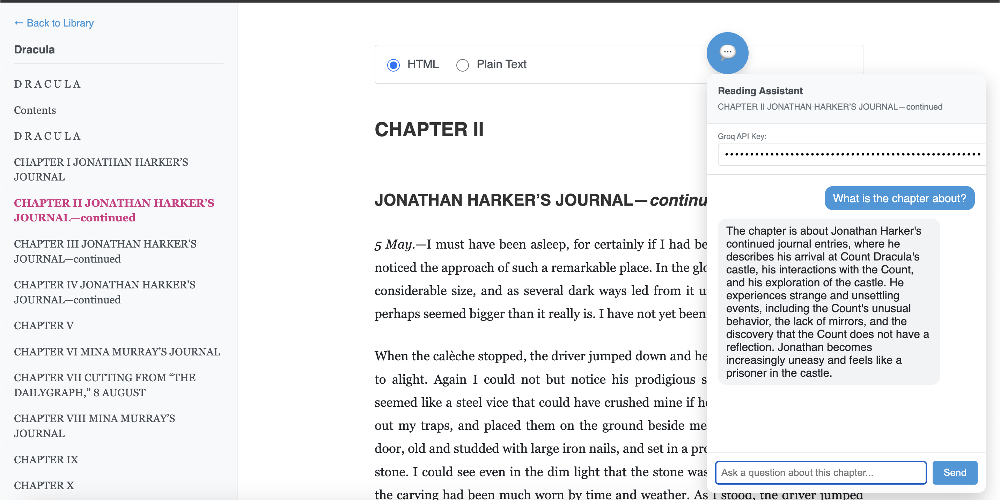

# llm assisted epub reader

## Older karpathy's version of epub reader


## Updated epub reader with LLM assistant


A lightweight, self-hosted LLM assisted EPUB reader that lets you read through EPUB books one chapter at a time. This makes it very easy to read a chapter and know that there is an LLM reading along side you that knows the chapter and can answer your queries like a pair-reader. Basically - get epub books (e.g. [Project Gutenberg](https://www.gutenberg.org/) has many), open them up in this reader, copy paste text around to your favorite LLM, and read together and along.

This project was forked from [Karpathy's reader3 repo](https://github.com/karpathy/reader3?tab=readme-ov-file) and modifications have been made on top of it to support LLM assisted reading.

## Features

- **Multiple Format Views**: View chapters in HTML, Plain Text, or llms.txt (structured markdown) format
- **LLM Chat Integration**: Chat with chapters using Groq API for real-time Q&A
- **On-Demand llms.txt Generation**: Generate llms.txt format for individual chapters on-demand from the reader interface

## Prerequisites

- Python 3.10+
- [uv](https://docs.astral.sh/uv/) package manager
- (Optional) Groq API key for llms.txt generation and chat features
  - Get your free API key from [Groq Console](https://console.groq.com/)
  - The API key is used to:
    - Generate llms.txt format on-demand for chapters
    - Enable chat functionality in the reader interface

## Usage

The project uses [uv](https://docs.astral.sh/uv/). So for example, download [Dracula EPUB3](https://www.gutenberg.org/ebooks/345) to this directory as `dracula.epub`, then:

### Processing EPUB Files

```bash
uv run reader3.py dracula.epub
```

This creates the directory `dracula_data`, which registers the book to your local library with HTML and Plain Text formats. The EPUB processing is quick and doesn't require any API keys.

### Running the Server

After processing your EPUB files, start the server:

```bash
uv run server.py
```

And visit [localhost:8123](http://localhost:8123/) to see your current Library. You can easily add more books, or delete them from your library by deleting the folder. It's not supposed to be complicated or complex.

### Reading Interface

Once you open a book in the reader:

- **Format Toggle**: Switch between HTML, Plain Text, and llms.txt formats using the radio buttons
  - The llms.txt option only appears if that format has been generated for the current chapter
  - If not available, you'll see a "Generate llms.txt" button instead

- **Generate llms.txt**: Click the "Generate llms.txt" button to create the structured markdown format for the current chapter
  - You'll be prompted to enter your Groq API key
  - The generated llms.txt is saved and will be available for future views
  - Once generated, the llms.txt radio button will appear in the format toggle

- **Chat Feature**: Click the chat button (💬) in the bottom-right corner to ask questions about the current chapter
  - You'll need to enter your Groq API key in the chat widget
  - The LLM will use llms.txt format if available, otherwise it will use plain text
  - The LLM has context of the current chapter and can answer questions about it

## What is llms.txt?

[llms.txt](https://llmstxt.org/) is a standardized format for making content more accessible to Large Language Models. In this reader:

- **llms.txt format**: A structured markdown representation of each chapter, optimized for LLM consumption
- **Benefits**: Better semantic structure, cleaner formatting, and improved LLM understanding of the content
- **Generation**: Created on-demand from the reader interface using Groq's LLM models to convert HTML to structured markdown
- **Storage**: Generated llms.txt files are saved per chapter and persist across sessions

The llms.txt format is particularly useful when you want to:
- Copy chapter content to LLMs for analysis
- Use chapters as context in LLM prompts
- Export content in a format that's optimized for AI tools

